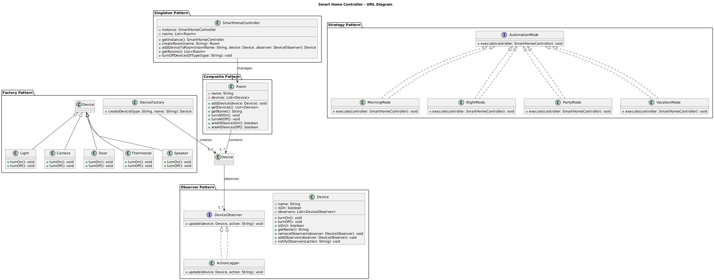

# Smart Home Controller

## Overview

The **Smart Home Controller** is a Java application designed to manage smart devices across multiple rooms. Users can:
- Control individual devices (turn on/off).
- Group devices by room for easier management.
- Activate preset automation routines like **Night Mode** and **Vacation Mode**.

The system is built using key design patterns like **Singleton**, **Factory**, **Observer**, and **Strategy** to ensure scalability and maintainability.

  

## How to Run the Program

1. **Download and Extract the Zip Folder**:  
   First, download the zip folder containing the project files and extract it to your preferred directory.

2. **Navigate to the Project Directory**:  
   Open a terminal or command prompt and navigate to the `smart-home-controller` directory where the project was extracted:
   ```bash
   cd smart-home-controller
   ```

3. **Compile the Program**:  
   Inside the project folder, compile the Java files using the following command:
   ```bash
   javac -d bin *.java controller/*.java devices/*.java model/*.java observer/*.java strategy/*.java
   ```

4. **Run the Program**:  
   After compiling, run the `Main` class to start the application:
   ```bash
   java -cp bin Main
   ```

5. **Using the Program**:  
   Once the program starts, a menu will appear for you to interact with the system:
   ```
   Welcome To Your Smart Home Controller
   1. Create Room
   2. Add Device to Room
   3. Turn ON/OFF a Device
   4. Turn ON/OFF All Devices in a Room
   5. Activate Automation Mode (Night/Vacation/Party/Morning)
   6. View Rooms and Devices
   7. Turn ON/OFF Devices by Type
   0. Exit
   ```

## Conclusion

This project demonstrates a modular smart home management system using essential design patterns for efficient device control and room management. It provides a solid foundation for further enhancements.